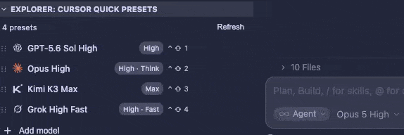

# Cursor Quick Presets

Easy-access model presets for Cursor — switch models and reasoning levels from the Explorer sidebar.

> **Requires [Cursor IDE](https://cursor.com).** This extension uses Cursor-only APIs and will not switch models in stock VS Code.



## Features

- Compact Explorer list with clickable presets
- Add as many presets as you want
- Pick any model from your Cursor catalog
- Pick reasoning / effort / fast variants per preset
- Per-preset hotkeys (Stream Deck friendly; duplicates blocked)
- Drag to reorder (or ↑ / ↓ on hover); hotkeys stay with their presets
- Remove or reconfigure anytime
- Vendor logos (OpenAI, Claude, Grok, Composer, Gemini, Kimi)

## Quick start

1. Install in **Cursor**
2. Open Explorer (`Cmd+Shift+E` / `Ctrl+Shift+E`), or run **Cursor Quick Presets: Show in Explorer**
3. Find **Cursor Quick Presets** under the file tree
4. Click a preset to switch models
5. Hover → **⚙** to change, **✕** to remove, **↑ / ↓** to reorder (or drag the row)
6. Use **Add model** at the bottom of the list for more presets
7. **⚙ → Set hotkey** and press a chord (e.g. Control+Shift+1) for Stream Deck

## Stream Deck / hotkeys

1. Hover a preset → **⚙** → **Set hotkey**
2. Press the shortcut (number keys stay as 1–9 even with Shift — shows like `^ ⇧ 1`)
3. On Stream Deck, map a button to that same chord (Cursor must be focused)

Hotkeys are saved to Cursor’s `keybindings.json` and move with the preset when you reorder. The same chord cannot be assigned to two presets (you can move it from one to another).

You can also bind **Keyboard Shortcuts** to `Cursor Quick Presets: Apply Preset 1` … `Apply Preset 9`, or call `cursorQuickPresets.applyPreset` with args `{ "index": 0 }` / `{ "slot": 1 }`.

## Commands

| Command | Description |
| --- | --- |
| `Cursor Quick Presets: Show in Explorer` | Open Explorer and reveal the presets (if closed) |
| `Cursor Quick Presets: Configure Preset` | Configure or add a preset from the command palette |
| `Cursor Quick Presets: Refresh Model Catalog` | Reload models from Cursor |
| `Cursor Quick Presets: Apply Preset 1–9` | Switch to that list slot (for hotkeys / Stream Deck) |

## Settings

`cursorQuickPresets.buttons` — variable-length array of presets:

```json
{
  "label": "Sol High",
  "modelId": "gpt-5.6-sol",
  "params": [
    { "id": "context", "value": "272k" },
    { "id": "reasoning", "value": "high" },
    { "id": "fast", "value": "false" }
  ]
}
```

`cursorQuickPresets.showToasts` — show status-bar feedback after switches (default `true`).

## Requirements

- Cursor IDE (recent desktop build)
- The extension reads your local Cursor model catalog and calls Cursor’s model-switch command

## Install from VSIX

```bash
cursor --install-extension ./cursor-quick-presets-0.1.5.vsix --force
```

Then reload the window.

## Privacy

Cursor Quick Presets reads Cursor’s local `state.vscdb` only to list available models/variants on your machine. Nothing is sent to a third-party server by this extension.

## License

MIT
